# Introduction

This assembly guide contains a potential assembly process for creating a postable vortex whistle. This guide contains the steps needed to create a model using only waterproof tape, and an alternative step if the sticker paper cover for the outlet is instead used.

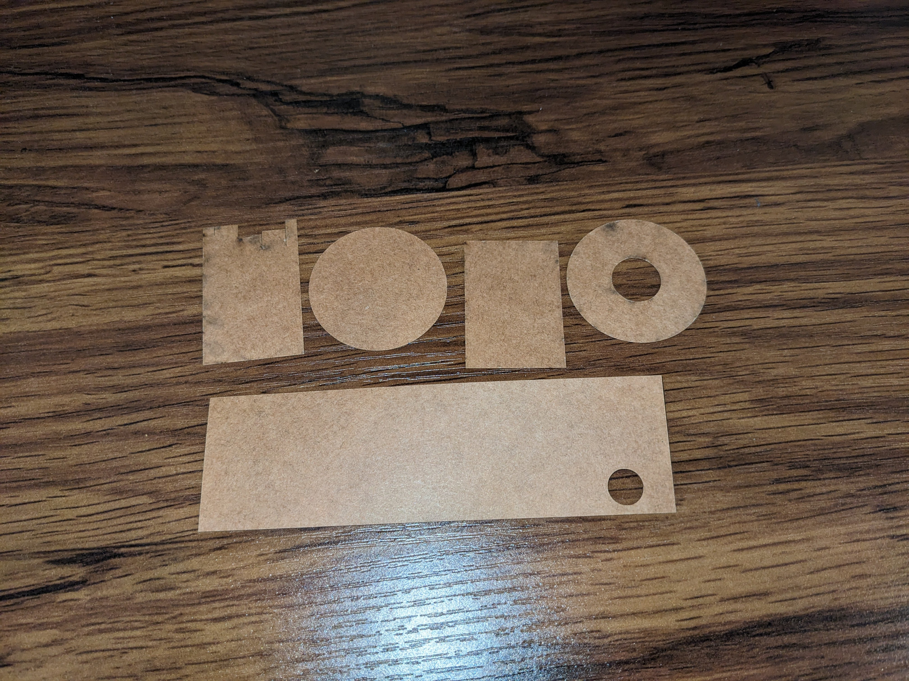

* Starting layout of all oilboard core components

# Assembly Guide

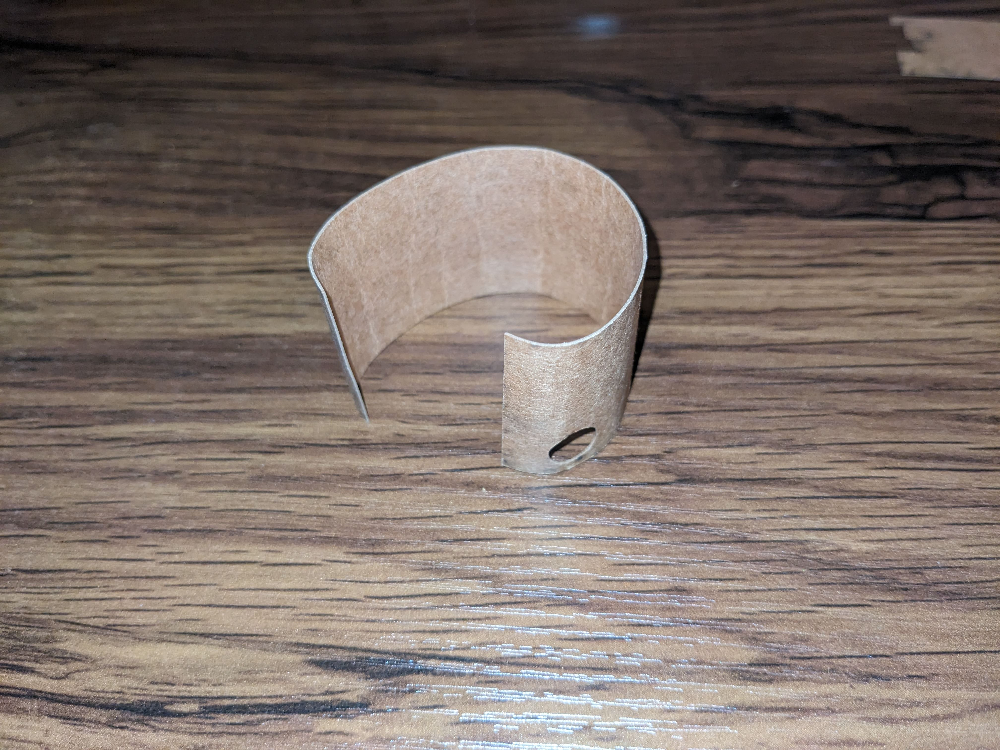
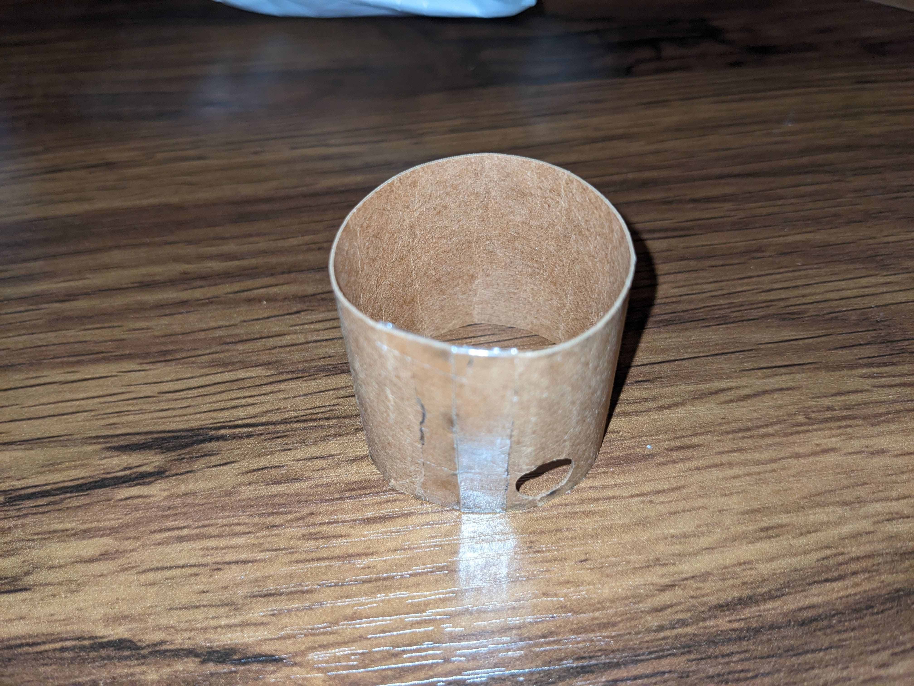

1. Start by folding the main whistle body (body-1 component) piece, then tape the gap to form a cylinder

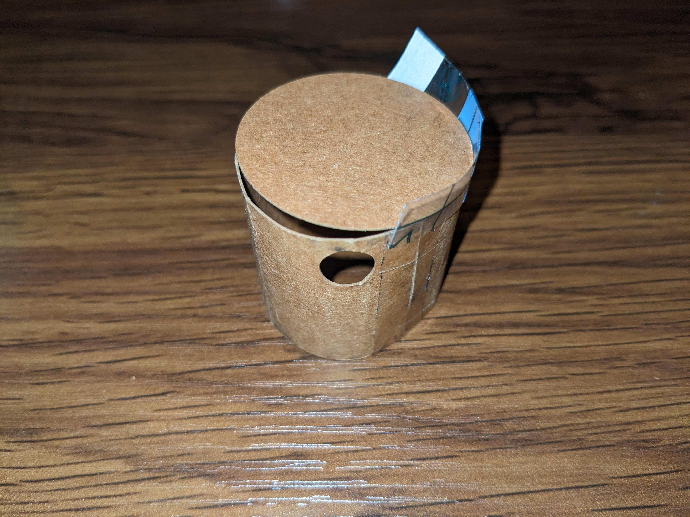
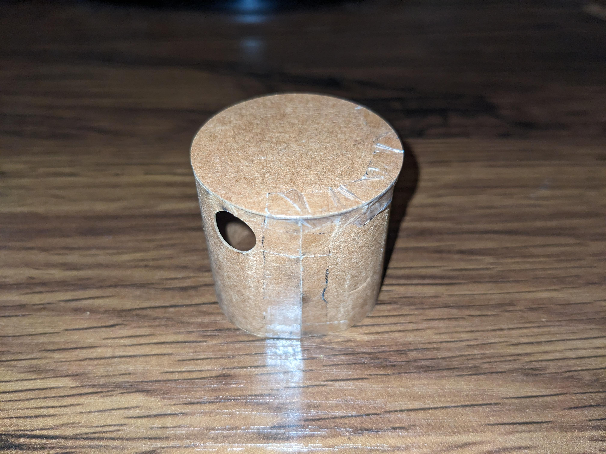

2. Place the lower base (body-2 component) piece on the whistle main body and add tape. Fully seal the seam/gap between the pieces

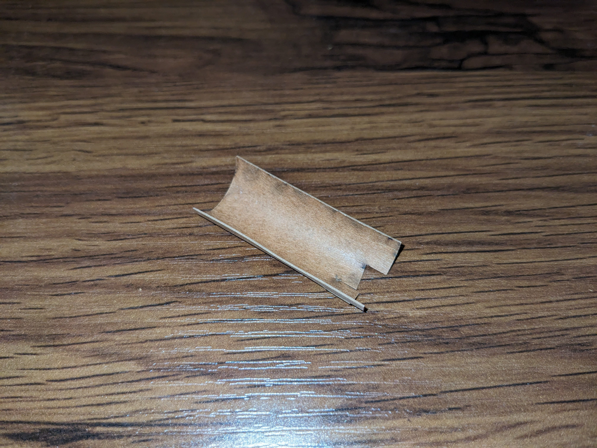
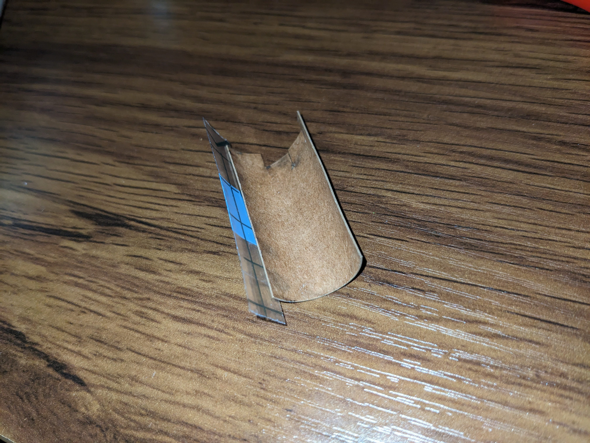
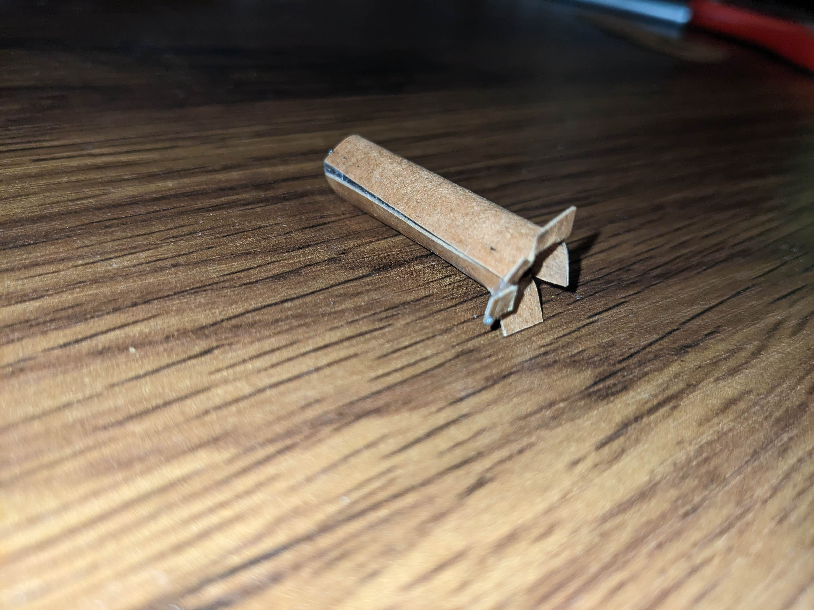

3. Fold the inlet piece, seal the main seam to form the cylinder shape of the inlet and then bend the tabs back slightly (this will help with seating the inlet later on).

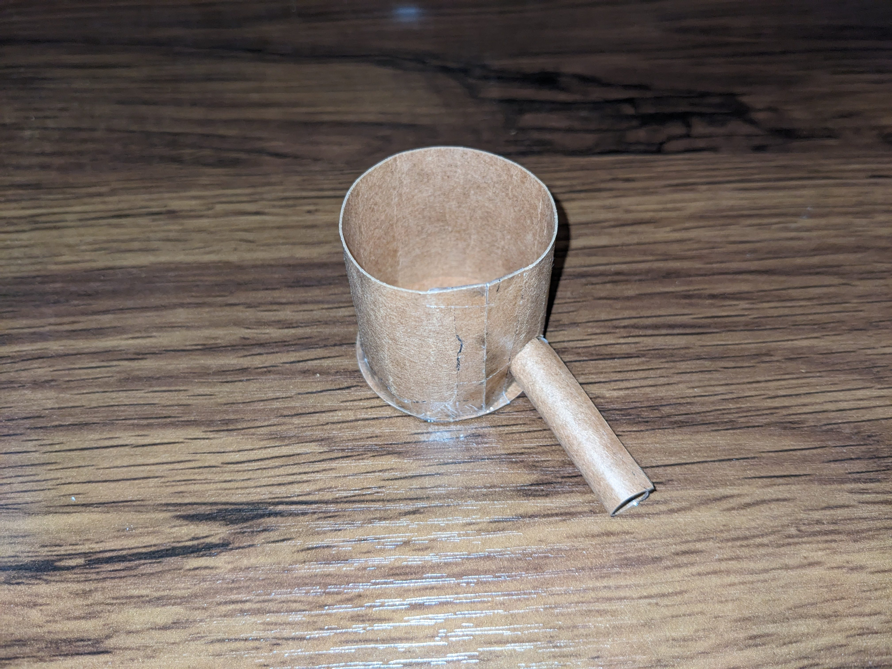

4. Insert the inlet into the main body piece through the small hold in the main body, being careful not to damage the seal between the main body and lower base. This may require bending the tabs of the inlet slightly to have the inlet fit through the hole.

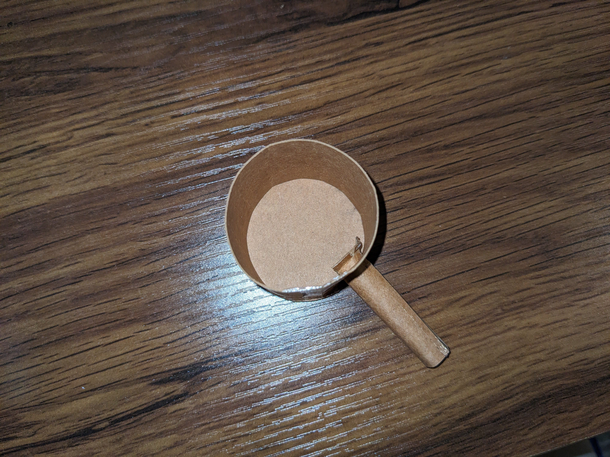

5. Once the inlet is passed through the hold in the body, press the tabs back outward, and make them flush with the inner wall of the main body.

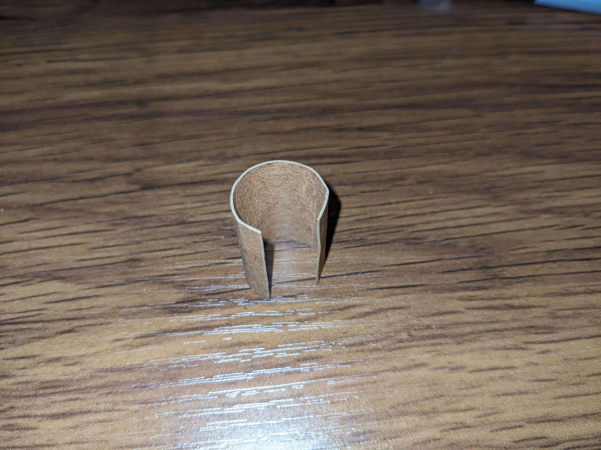
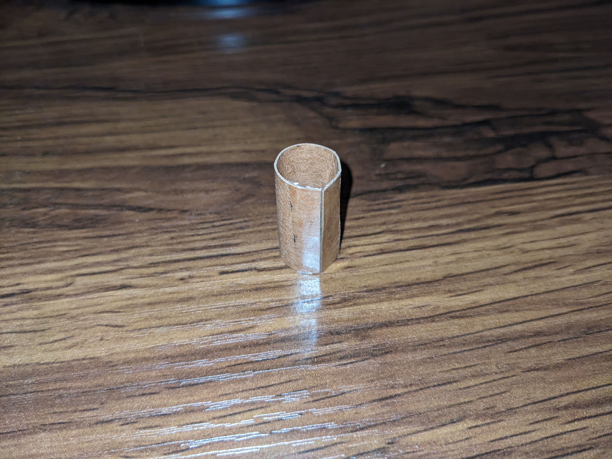

6. Fold the outlet and seal the seam to form a cylinder.

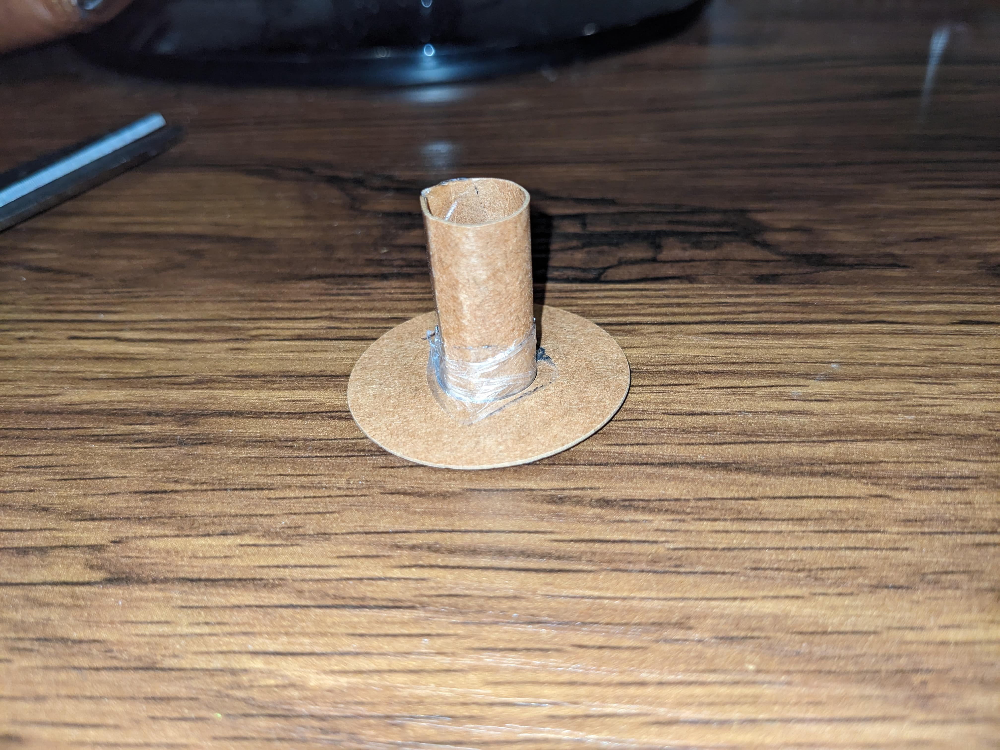

7.  Tape the outlet to fit over the inner hole of the upper base (body-3 component) of the whistle.
   * If desired for use, the sticker paper skin can be instead applied around the outlet, with the tabbed pieces folded back. When joining these pieces, the tabs will be flush with and stick to the surface of the upper base. Tape can then be applied over the same seam of the components to ensure a proper seal between the upper base and outlet.

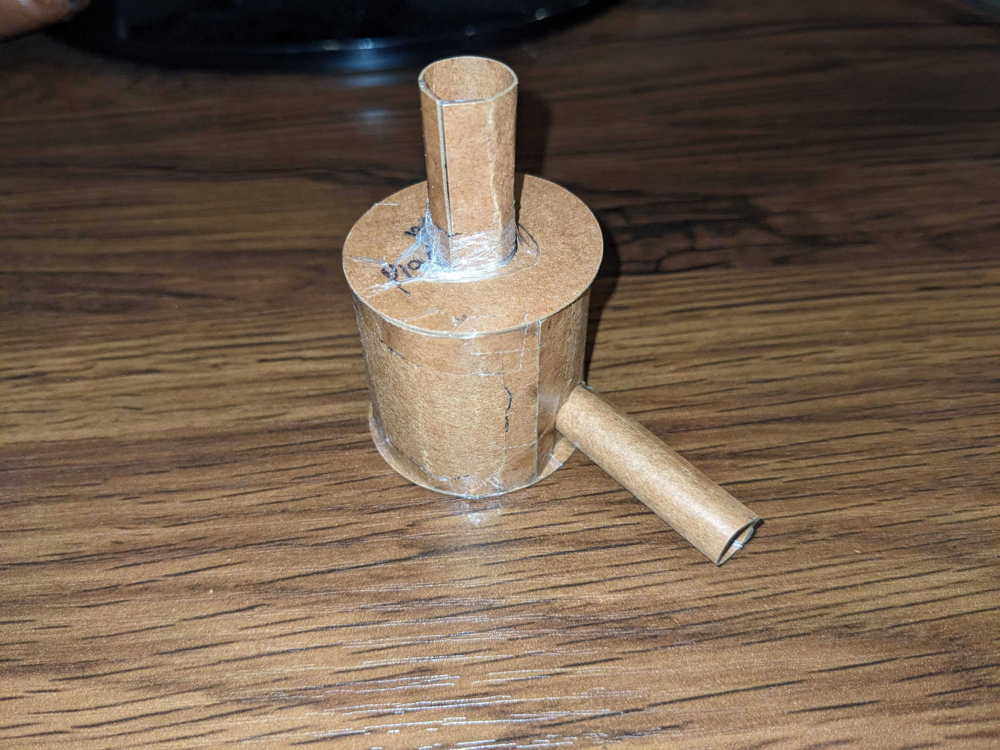  

8.  In a similar process to the lower base (body-2) component, tape the upper base piece to the top of the main body, ensuring no gaps.
   * To increase air tightness of the device, tape can be added around the gap between the inlet and the main body if desired.
